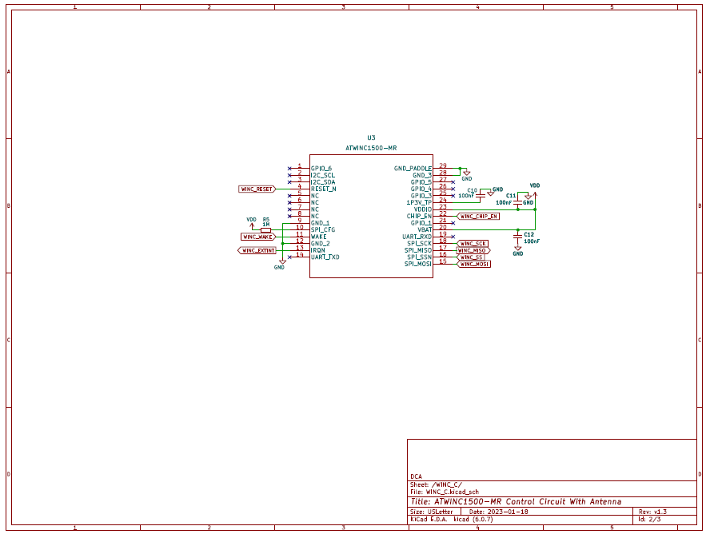

<!-- PROJECT LOGO -->
 

  
<h3 align="center">Ultrasonic Flow Reader</h3>

  

    The Ultra Sonic Flow Reader is a non-invasive, innovative solution that enables real-time water flow monitoring in pipes using ultrasonic waves. Designed for homeowners, residential and industrial building owners, and property managers, this device helps reduce installation costs and risks associated with traditional inline installations, while promoting water conservation and potential cost savings.
     
     
    <a href="https://github.com/DarmorGamz/Ultrasonic-Flow-Reader">View Demo</a>
    ·
    <a href="https://github.com/DarmorGamz/Ultrasonic-Flow-Reader/issues">Report Bug</a>
    ·
    <a href="https://github.com/DarmorGamz/Ultrasonic-Flow-Reader/issues">Request Feature</a>
  

### Built With

[![C][C.com]][C-url]

[![HTML.com]][HTML-url] [![CSS3.com]][CSS3-url] [![JavaScript.com]][JavaScript-url]

[![PHP.com]][PHP-url] [![MYSQL.com]][MYSQL-url] [![Linux.com]][Linux-url] [![AWS.com]][AWS-url]

<!-- ABSTRACT -->
## ABSTRACT
The Ultra Sonic Flow Reader is a non-invasive solution designed to measure the flow of water in pipes using ultrasonic waves, eliminating the need for costly and time-consuming inline installation by licensed plumbers. Targeting homeowners, residential and industrial building owners, and property managers, this innovative device empowers users to monitor their water usage in real time, leading to potential cost savings and improved water conservation. The project employs ultrasonic transducers, a SAMD20 microcontroller, Winc1500 for WiFi, ENC28J60 for Ethernet, and leverages AWS for RDS, EC2, and Route53. The firmware is developed using Embedded C, with a PHP backend, and a frontend designed using HTML, CSS, and JavaScript. The Ultra Sonic Flow Reader is expected to minimize the need for hiring plumbers and reduce the risk of potential damage associated with traditional inline installations. The project's final demonstration is scheduled for April 13, 2023, showcasing a user-friendly and efficient solution for real-time water usage monitoring.

<!-- INTRODUCTION -->
## INTRODUCTION

#### Enhancing Water Usage Monitoring
The Ultra Sonic Flow Reader project was conceived with the primary goal of addressing a pressing need in the field of water monitoring and management. Traditional methods for measuring water flow in pipes typically require invasive installations and the assistance of licensed plumbers. This process can be both expensive and time-consuming, posing significant challenges for homeowners, residential and industrial building owners, and property managers who are looking to monitor their water usage in real time. As water scarcity becomes an increasingly critical global issue, there is a growing demand for innovative solutions that facilitate efficient water management and conservation.

#### Target Users and Applications
The project's scope encompasses the design and development of a non-invasive, cost-effective, and user-friendly device capable of real-time water usage monitoring. The Ultra Sonic Flow Reader employs advanced technologies such as ultrasonic transducers, a SAMD20 microcontroller, Winc1500 for WiFi, and ENC28J60 for Ethernet. In addition, it leverages Amazon Web Services (AWS) for database management (RDS), cloud computing (EC2), and domain name management (Route53). The device's firmware is developed using Embedded C, while the backend is built using PHP, and the frontend is designed with HTML, CSS, and JavaScript.

#### Project Development Phases
The approach taken to the project involved extensive research, planning, and execution of various design phases, including hardware and software development, integration, and testing. The interdisciplinary team, consisting of Darren Morrison, Austin Cormier, and Carter Glynn, collaborated closely under the supervision of Professors Hameed Al-Aubodah, Hamood-ur Rehman, Jane Carr, and Mehrdad Hajivandi to bring the project to fruition.

#### Challenges of Traditional Inline Installations
The Ultra Sonic Flow Reader project has been designed with a focus on simplicity, adaptability, and ease of use. Recognizing the diverse needs of homeowners, property managers, and residential and industrial building owners, the team has strived to create a solution that caters to a wide range of applications. The device's non-invasive nature ensures that it can be installed without causing disruptions to existing infrastructure or requiring specialized skills.
Throughout the project, the team has been guided by a set of core principles, including innovation, collaboration, and a commitment to addressing real-world challenges. These principles have driven the development process and informed key decisions, such as the selection of appropriate hardware components, software design, and integration strategies. Additionally, the team has placed a strong emphasis on testing and validation, ensuring that the Ultra Sonic Flow Reader consistently delivers accurate and reliable results.
As the project progresses towards its final demonstration, scheduled for April 13, 2023, the team remains dedicated to refining the Ultra Sonic Flow Reader and addressing any outstanding issues or limitations. The team acknowledges that further research and development efforts will be essential in enhancing the device's applicability to a wider range of pipe sizes and optimizing its power supply requirements. By addressing these challenges, the Ultra Sonic Flow Reader will be better positioned to meet the needs of its target users and make a positive impact on water management and conservation efforts.
In summary, the Ultra Sonic Flow Reader project represents a significant advancement in the field of water monitoring and management. By offering a non-invasive, cost-effective, and user-friendly solution for real-time water usage monitoring, the device has the potential to transform the way homeowners, building owners, and property managers approach water conservation. This report serves to document the project's journey from conception to completion, providing a comprehensive account of the team's research, development, and validation efforts.
This report details the problem statement, which outlines the challenges faced by traditional inline water flow monitoring systems and the need for a non-invasive alternative. The development process, including the project proposal, changes and decisions made throughout the project, and challenges encountered in implementation, is thoroughly discussed. Furthermore, the report presents the testing procedures and results, including Sprint tests, Product Validation tests, and an assessment of whether all user needs and requirements have been met. To support the report, relevant research materials, schematics, flowcharts, source code, and other documentation are included in the appendices.

#### Problem Statement
The Ultra Sonic Flow Reader project aims to revolutionize water monitoring by providing a solution that eliminates the need for hiring plumbers and reduces the risk of potential damage associated with traditional inline installations. By offering real-time water usage monitoring, the device empowers users to make informed decisions about their water consumption, leading to potential cost savings and improved water conservation efforts.

#### Report Structure
This report is organized into several sections, each focusing on a different aspect of the project. Following the introduction, the report details the problem statement, project development process, testing procedures and results, and any remaining limitations or challenges. The appendices provide additional documentation and materials to support the main body of the report.

<!-- INTRODUCTION -->
## DISCUSSION
The development of the Ultra Sonic Flow Reader project can be broken down into several key phases, each contributing to the overall success of the project. In this section, we discuss the progression of the project from proposal to completion, highlighting the changes and decisions made, challenges faced during implementation, and the various tests conducted.

#### Project Proposal and Initial Development
The project proposal was the foundation for the Ultra Sonic Flow Reader, outlining the primary objectives, expected outcomes, and proposed timeline. The team performed extensive research on existing flow measurement methods, identifying the limitations and drawbacks of traditional inline installations. This analysis informed the decision to pursue a non-invasive solution using ultrasonic waves for flow measurement.
Initial development focused on selecting appropriate hardware components, such as the ultrasonic transducers and SAMD20 microcontroller, and designing the basic hardware structure. The team also began work on the firmware using Embedded C and the backend using PHP, laying the groundwork for further development.

#### Iterative Development and Integration
Throughout the project, the team adopted an iterative development process, allowing for continuous improvements and adjustments. Hardware and software components were developed in parallel, with regular integration and testing to ensure compatibility and functionality.
Several changes were made during the development process, including the addition of Winc1500 for WiFi connectivity, ENC28J60 for Ethernet support, and the utilization of AWS for cloud-based services. These changes were made to enhance the device's usability and align it with modern IoT-based solutions.

#### Challenges and Implementation
The team encountered various challenges during the implementation phase. These included limited funding, time constraints, and complexities in debugging and hardware design. To overcome these challenges, the team members worked collaboratively, leveraging their individual skills and expertise to find solutions.
One of the key challenges was ensuring accurate flow measurement across various pipe sizes and materials. The team focused on refining the ultrasonic transducer placement and signal processing algorithms to achieve reliable results. Furthermore, optimizing power consumption was a priority, and the team worked on designing an energy-efficient system that minimizes the need for additional power sources.

#### Testing and Results
The Ultra Sonic Flow Reader underwent a series of tests to ensure its functionality, accuracy, and reliability. These tests included User Information Handling, API testing, Hardware Event Handling, and Hardware Timers testing. Each test was designed to evaluate specific aspects of the device's performance and identify areas for improvement.
The results of these tests showed that the Ultra Sonic Flow Reader met most user needs and requirements, delivering accurate flow measurements and a responsive user interface. However, some limitations were identified, such as the need for a more modular sensor PCB mount and optimization of the power supply.

#### References to Appendices
Throughout the report, references are made to the appendices, which contain supplementary material such as research materials, schematics, flowcharts, and source code. These documents provide a more in-depth understanding of the Ultra Sonic Flow Reader's design and development process and can be used to replicate the project and verify its results.

<!-- RECOMMENDATION -->
## RECOMMENDATION
Based on the findings and conclusions of the Ultra Sonic Flow Reader project, the following recommendations are provided to guide future research, development, and commercialization efforts.

#### Wider Pipe Size Compatibility
The current design supports only 1-inch pipes, limiting the applicability of the device. Future research should focus on developing a more modular sensor PCB mount, enabling compatibility with a broader range of pipe sizes to cater to various residential and industrial applications.

#### Power Supply Optimization
The power supply requirements of the current design demand a minimum of 12V for the sensor PCB to function. Optimizing the power supply to support lower voltage levels could enhance the device's energy efficiency, minimize the need for additional power sources, and potentially extend its battery life.

#### Enhanced User Interface
While the existing user interface is functional, it could benefit from further refinement to improve user experience. Future iterations should consider incorporating more advanced data visualization features, customizable alerts, and a mobile application for increased accessibility.

#### Market Research and Consumer Feedback
Conduct market research and solicit feedback from potential end-users to gain insights into user needs, preferences, and potential use cases. This information can inform future design decisions and contribute to the development of a more market-ready product.

#### Compliance with Regulatory Standards
As the project moves towards commercialization, it is crucial to research safety requirements, electronic stamping, and other relevant industry standards to ensure the Ultra Sonic Flow Reader complies with all necessary regulations.

#### Cost Reduction and Production Efficiency
To improve profit margins and streamline production, consider bulk purchasing of components, outsourcing board soldering, and adopting lean manufacturing practices.

#### Long-term Testing and Reliability
Further long-term testing should be conducted to assess the device's durability, performance consistency, and overall reliability under various environmental conditions and extended usage periods.
By addressing these recommendations, the Ultra Sonic Flow Reader can evolve into a more refined and market-ready product, better positioned to meet the needs of its target users and contribute significantly to water conservation efforts.

<!-- APPENDICES -->
## APPENDICES
#### Schematics

Fig. 1.	MCU - Atmel SAMD20 circuit.

 
Fig. 2.	Wifi – Winc1500 circuit.

Fig. 3.	Ethernet – ENC28J60 circuit.

 
Fig. 4.	Sensor – Ultra sonic flow reader circuit.   

#### Flowcharts

Fig. 5. Cloud – AWS design flowchart

<!-- GETTING STARTED -->
## Getting Started

This is an example of how you may give instructions on setting up your project locally.
To get a local copy up and running follow these simple example steps.

### Prerequisites

### Installation

(<a href="#readme-top">back to top</a>)

<!-- CONTRIBUTING -->
## Contributing

Contributions are what make the open source community such an amazing place to learn, inspire, and create. Any contributions you make are **greatly appreciated**.

If you have a suggestion that would make this better, please fork the repo and create a pull request. You can also simply open an issue with the tag "enhancement".
Don't forget to give the project a star! Thanks again!

1. Fork the Project
2. Create your Feature Branch (`git checkout -b feature/AmazingFeature`)
3. Commit your Changes (`git commit -m 'Add some AmazingFeature'`)
4. Push to the Branch (`git push origin feature/AmazingFeature`)
5. Open a Pull Request

(<a href="#readme-top">back to top</a>)

<!-- LICENSE -->
## License

Distributed under the Eyedro Green Solutions License. See `LICENSE.txt` for more information.

(<a href="#readme-top">back to top</a>)

<!-- CONTACT -->
## Contact

Darren Morrison - darren09@live.ca  
Austin Cormier - austin14cormier@gmail.com   
Carter Glynn - carter.glynn14@gmail.com  

Project Link: [https://github.com/DarmorGamz/Ultrasonic-Flow-Reader](https://github.com/DarmorGamz/Ultrasonic-Flow-Reader)

(<a href="#readme-top">back to top</a>)

<!-- ACKNOWLEDGMENTS -->
## Acknowledgments
We are deeply grateful to the following individuals for their invaluable contributions, guidance, and support during the development of the Ultra Sonic Flow Reader project:   

#### Dr. Hameed Al-Aubodah, PhD
*For his expertise in electrical theory (DC, AC, Transmission lines) and digital design, and for being an inspiring role model in the engineering field.*

#### Dr. Hamood-Ur Rehman, PhD
*For sharing essential software and programming knowledge, ensuring elegant, readable, and maintainable code, and for setting high expectations that contributed to the project's success.*

#### Dr. Mehrdad Hajivandi, PhD P.Eng
*For his guidance in mathematics and advanced thinking principles crucial to the project's development.*

#### Jane Carr
*For her expertise in testing, debugging, verification, and documentation, which played a significant role in the project's completion.*   
 
We also extend our appreciation to Eyedro Green Solutions for their generous funding, access to lab equipment, and invaluable mentorship throughout the project. Special thanks to:   

#### Trevor Orton, CEO
*For his guidance in cloud computing, backend development, and writing and maintaining quality code.*

#### Nick Gamble, CFO
*For sharing his expertise in embedded software, embedded systems, networking, and data analysis.*

#### Jeff Conley
*For his dedication to hardware design, product specifications, circuit design, PCB assembly, and document review.*  

(<a href="#readme-top">back to top</a>)

<!-- REFERENCES -->
## References

T. Dean, "Sonar," Brown University, [Online]. Available: https://cs.brown.edu/people/tdean/courses/cs148/02/sonar.html.  
D. Russell, "The Doppler Effect," Kettering University, [Online]. Available: https://web.archive.org/web/20071119085900/http://www.kettering.edu/~drussell/Demos/doppler/doppler.html.  
University of Bristol, "Time-of-Flight Mass Spectrometry," [Online]. Available: https://web.archive.org/web/20120310184539/http://www.chm.bris.ac.uk/ms/theory/tof-massspec.html.  
J. Steensgaard, "Bootstrapped low-voltage analog switches," in 1999 IEEE International Symposium on Circuits and Systems (ISCAS), Orlando, FL, USA, 1999, pp. 29-32, vol.2, doi: 10.1109/ISCAS.1999.780611.  
Microchip Technology Inc., "SAMD20 Family Datasheet," [Online]. Available: https://ww1.microchip.com/downloads/en/DeviceDoc/SAM_D20_Family_Datasheet_DS60001504C.pdf.  
Microchip Technology Inc., "ENC28J60 Stand-Alone Ethernet Controller with SPI Interface," [Online]. Available: https://ww1.microchip.com/downloads/aemDocuments/documents/OTH/ProductDocuments/DataSheets/39662e.pdf. 
Microchip Technology Inc., "ATWINC15x0-MR210xB IEEE 802.11 b/g/n SmartConnect IoT Module," [Online]. Available: https://ww1.microchip.com/downloads/aemDocuments/documents/WSG/ProductDocuments/DataSheets/ATWINC15x0-MR210xB-IEEE-802.11-b-g-n-SmartConnect-IoT-Module-DS70005304E.pdf.  
Amazon Web Services, "Amazon EC2 User Guide," [Online]. Available: https://docs.aws.amazon.com/AWSEC2/latest/UserGuide/concepts.html.  
Amazon Web Services, "Amazon RDS User Guide," [Online]. Available: https://docs.aws.amazon.com/AmazonRDS/latest/UserGuide/Welcome.html.  

(<a href="#readme-top">back to top</a>)

<!-- MARKDOWN LINKS & IMAGES -->
<!-- https://www.markdownguide.org/basic-syntax/#reference-style-links -->
[contributors-shield]: https://img.shields.io/github/contributors/DarmorGamz/Ultrasonic-Flow-Reader.svg?style=for-the-badge
[contributors-url]: https://github.com/DarmorGamz/Ultrasonic-Flow-Reader/graphs/contributors
[forks-shield]: https://img.shields.io/github/forks/DarmorGamz/Ultrasonic-Flow-Reader.svg?style=for-the-badge
[forks-url]: https://github.com/DarmorGamz/Ultrasonic-Flow-Reader/network/members
[stars-shield]: https://img.shields.io/github/stars/DarmorGamz/Ultrasonic-Flow-Reader.svg?style=for-the-badge
[stars-url]: https://github.com/DarmorGamz/Ultrasonic-Flow-Reader/stargazers
[issues-shield]: https://img.shields.io/github/issues/DarmorGamz/Ultrasonic-Flow-Reader.svg?style=for-the-badge
[issues-url]: https://github.com/DarmorGamz/Ultrasonic-Flow-Reader/issues
[license-shield]: https://img.shields.io/github/license/DarmorGamz/Ultrasonic-Flow-Reader.svg?style=for-the-badge
[license-url]: https://github.com/DarmorGamz/Ultrasonic-Flow-Reader/blob/master/LICENSE.txt
[linkedin-shield]: https://img.shields.io/badge/-LinkedIn-black.svg?style=for-the-badge&logo=linkedin&colorB=555
[linkedin-url]: https://linkedin.com/in/darren--morrison

[C.com]: https://img.shields.io/badge/c-%2300599C.svg?style=for-the-badge&logo=c&logoColor=white
[C-url]: https://www.cprogramming.com
[PHP.com]: https://img.shields.io/badge/php-%23777BB4.svg?style=for-the-badge&logo=php&logoColor=white
[PHP-url]: https://www.php.net/
[MYSQL.com]: https://img.shields.io/badge/mysql-%2300f.svg?style=for-the-badge&logo=mysql&logoColor=white
[MYSQL-url]: https://www.mysql.com/
[HTML.com]: https://img.shields.io/badge/html5-%23E34F26.svg?style=for-the-badge&logo=html5&logoColor=white
[HTML-url]: https://www.w3.org/html/#:~:text=W3C%20HTML&text=https%3A%2F%2Fhtml.spec.whatwg,is%20the%20current%20HTML%20standard.
[CSS3.com]: https://img.shields.io/badge/css3-%231572B6.svg?style=for-the-badge&logo=css3&logoColor=white
[CSS3-url]: https://www.css3.com/
[JavaScript.com]: https://img.shields.io/badge/javascript-%23323330.svg?style=for-the-badge&logo=javascript&logoColor=%23F7DF1E
[JavaScript-url]: https://www.javascript.com/

[Linux.com]: https://img.shields.io/badge/Linux-FCC624?style=for-the-badge&logo=linux&logoColor=black
[Linux-url]: https://aws.amazon.com/amazon-linux-2/

[AWS.com]: https://img.shields.io/badge/AWS-%23FF9900.svg?style=for-the-badge&logo=amazon-aws&logoColor=white
[AWS-url]: https://aws.amazon.com/

[PHPStorm.com]: https://img.shields.io/badge/phpstorm-143?style=for-the-badge&logo=phpstorm&logoColor=black&color=black&labelColor=darkorchid
[PHPStorm-url]: https://www.jetbrains.com/phpstorm/
